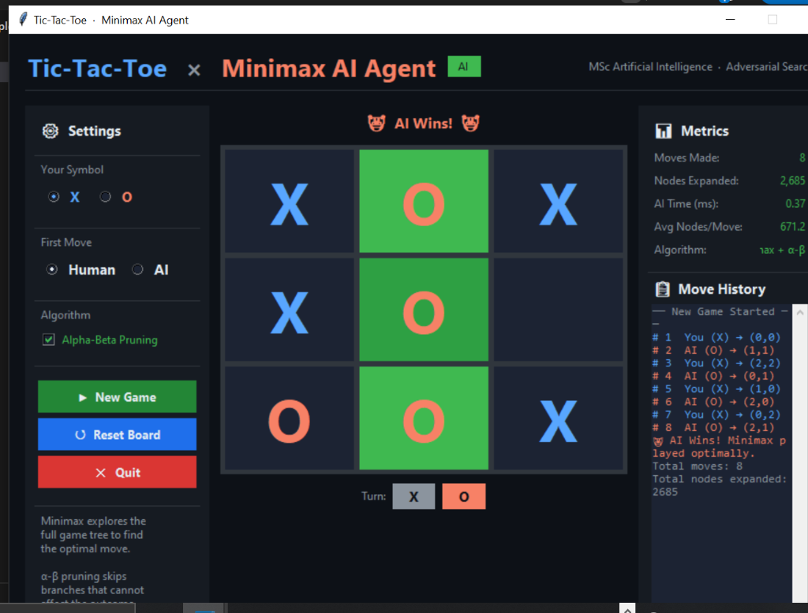

# 🎮 Tic-Tac-Toe — Minimax AI Agent

<p align="center">
  
  
  
  
</p>

<p align="center">
  A fully functional, GUI-based Tic-Tac-Toe game powered by an <strong>optimal Minimax AI agent</strong>
  with optional <strong>Alpha-Beta pruning</strong>.
</p>

<p align="center">
  
</p>

---

## 📋 Assignment Information

| Field | Detail |
|---|---|
| **Course** | Artificial Intelligence |
| **Program** | Master of Science in Artificial Intelligence |
| **Topic** | Adversarial Search – Minimax Algorithm |
| **Instructor** | Dr. Natnael Argaw Wondimu |

---

## 🚀 Quick Start

> No installation. No dependencies. Just Python.

```bash
python gui_game.py
```

The GUI window launches immediately.

**Requirements:** Python 3.7+ with `tkinter` (included in all standard Python distributions).

---

## 🖥️ Interface Preview

The game features a **dark premium GUI** built with Python's built-in `tkinter`:

- 🎨 Dark theme with vibrant X / O colour coding
- ✨ Hover effects and winning-line flash animation
- 📊 Live performance metrics panel (nodes expanded, AI time, averages)
- 📋 Colour-coded move history log
- ⚙️ In-game settings: symbol choice, first-player choice, Alpha-Beta toggle
- 🔁 Play again without restarting the program

---

## 🏗️ Project Structure

The entire project lives in **one self-contained file**:

```
gui_game.py
├── § 2  TicTacToe      — Game state, legal actions, terminal detection, utility function
├── § 3  MinimaxAgent   — Minimax search algorithm + Alpha-Beta pruning
└── § 4  TicTacToeGUI   — tkinter GUI, event handling, animations, metrics panel
```

---

## 🧠 Technical Design

### Game Representation

Tic-Tac-Toe satisfies all required properties for adversarial search:

| Property | Satisfied |
|---|---|
| Deterministic | ✅ No randomness |
| Turn-based | ✅ Players alternate |
| Zero-sum | ✅ One player's gain is the other's loss |
| Perfect information | ✅ Full board always visible |

**State** — 3×3 grid where each cell holds `' '`, `'X'`, or `'O'`  
**Legal actions** — all empty cells `(row, col)`  
**Terminal states** — three in a row, or board full  
**Utility function** — evaluated from the AI's perspective:

| Outcome | Value |
|---|---|
| AI wins | **+10** |
| Draw | **0** |
| AI loses | **−10** |

---

### Minimax Algorithm

The AI explores the **complete game tree** and selects the action that maximises its minimum guaranteed utility — assuming the human also plays optimally.

```
MINIMAX(state):
    if TERMINAL(state):
        return UTILITY(state)

    if MAX player's turn:
        return  max { MINIMAX(child) for each child of state }
    else:
        return  min { MINIMAX(child) for each child of state }
```

---

### Alpha-Beta Pruning *(Bonus Feature)*

An optimisation that **prunes branches** which cannot affect the final decision, without changing the result.

- **α** — best value the maximiser has secured on the current path  
- **β** — best value the minimiser has secured on the current path  
- Prune when `max_val ≥ β` or `min_val ≤ α`

**Performance comparison (Tic-Tac-Toe):**

| Move | Without Pruning | With α-β | Reduction |
|---|---|---|---|
| 1st AI move | ~55 000 nodes | ~2 500 nodes | **~95 %** |
| 3rd AI move | ~7 000 nodes | ~400 nodes | **~94 %** |
| 5th AI move | ~300 nodes | ~50 nodes | **~83 %** |

Toggle Alpha-Beta on/off live inside the GUI to see the difference in node counts.

---

## 🎯 Bonus Features

| Feature | Status |
|---|---|
| Alpha-Beta Pruning | ✅ Implemented & toggleable |
| Performance Metrics (nodes, time, averages) | ✅ Implemented |
| Player chooses symbol (X / O) | ✅ Implemented |
| Player chooses who goes first | ✅ Implemented |

---

## 📌 Key Insight

> When both players play optimally, Tic-Tac-Toe **always ends in a draw**.  
> The Minimax AI **never loses**. The best a human can achieve is a draw.

---

## 📚 References

1. Russell, S., & Norvig, P. (2020). *Artificial Intelligence: A Modern Approach* (4th ed.). Pearson.  
2. Knuth, D. E., & Moore, R. W. (1975). An analysis of alpha-beta pruning. *Artificial Intelligence, 6*(4), 293–326.
